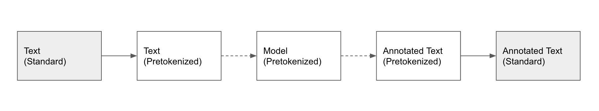

# Data

-----------
## Overview

The first step in the **nerblackbox** workflow (after the mandatory [Preparation](preparation.md)) is 
to choose a dataset. Datasets for NER can differ in many regards:

- [Dataset Source](#dataset-sources): Many datasets are publicly available on HuggingFace or in GitHub repositories. You may also have private datasets on your local filesystem or an annotation tool server.
- [Dataset Type](#dataset-types): Some datasets are pretokenized while others come as plain text together with a list of entities and their spans. 
- [Dataset Format](#dataset-formats): Even for two datasets of the same [Dataset Type](#dataset-types), the specific formatting of the data may differ.
- [Dataset Splits](#dataset-splits): Some datasets are divided into train/validation/test subsets, while others only have train/test subsets, or aren't split into subsets at all.
- [Annotation Scheme](#annotation-schemes): There exist different annotation schemes like IO, BIO, BILOU and variations thereof.

**nerblackbox** can handle all these different cases automatically. 
It provides a simple [Dataset](../python_api/dataset) class which allows to easily set up any dataset and make it readily available for training and evaluation:

??? note "set up a dataset"
    === "Python"
        ``` python
        dataset = Dataset(name="<dataset_name>", source="<source>")  # <source> = HF, BI, LF
        dataset.set_up()
        ```

    This creates dataset files in the folder `./store/datasets/<dataset_name>`.

The above procedure may---depending on the dataset---include downloading, reformatting, train/validation/test splitting and an analysis of the data.
In the following, we will describe the details of this procedure.

-----------
## Dataset Sources

Datasets can be taken directly from [HuggingFace (HF)](#huggingface-hf), 
the pool of [Built-in (BI)](#built-in-bi) datasets, or
the [Local Filesystem (LF)](#local-filesystem-lf).
Integration of data from [Annotation Tool (AT)](#annotation-tool-at) servers is also possible.

### HuggingFace (HF)

To employ a dataset from HuggingFace, specify ``"HF"`` as the source in addition to the name of the dataset:

??? example "set up a dataset from HuggingFace (HF)"
    === "Python"
        ``` python
        dataset = Dataset(name="conll2003", source="HF")
        dataset.set_up()
        ```

Dataset subsets, if existent, can also be chosen. 
For more details, we refer to the [Python API documentation](../python_api/dataset).


### Built-in (BI)

The following datasets are built-in:

| Name               | Full Name          | Language | Open Source | Annotation Scheme | Sample Type  | #Samples (Train, Val, Test) | Required Files | Source                                                                                                                  |               
|--------------------|--------------------|---       |---          |---                |---           |---                          |---             |-------------------------------------------------------------------------------------------------------------------------|
| swedish_ner_corpus | Swedish NER Corpus | Swedish  | Yes         |  IO               | Sentence     | (4819, 2066, 2453)          |---             | [Description+Data](https://github.com/klintan/swedish-ner-corpus)                                                       |
| sic                | SIC                | Swedish  | Yes         | BIO               | Sentence     | (436, 188, 268)             |---             | [Description+Data](https://www.ling.su.se/english/nlp/corpora-and-resources/sic)                                        |
| suc                | SUC 3.0            | Swedish  | No          | BIO               | Sentence     | (71046, 1546, 1568)         | `suc-*.conll`  | [Description](https://www.ling.su.se/english/nlp/corpora-and-resources/suc)                                             |
| swe_nerc           | Swe-NERC           | Swedish  | Yes         | BIO               | Sentence     | (6841, 878, 891)            | ---            | [Description](https://gubox.app.box.com/v/SLTC-2020-paper-17); [Data](https://spraakbanken.gu.se/lb/resurser/swe-nerc/) |

To employ a built-in dataset, specify ``"BI"`` as the source in addition to the name of the dataset:

??? example "set up a dataset that is Built-in (BI)"
    === "Python"
        ``` python
        dataset = Dataset(name="swe_nerc", source="BI")
        dataset.set_up()
        ```

Note that for datasets which are not open source, the `Required Files` need to be provided manually, see [Local Filesystem (LF)](#local-filesystem-lf).


### Local Filesystem (LF)

Data from the Local Filesystem needs to be stored either as ``.jsonl`` or ``.csv``, depending on the [Dataset Type](#dataset-types).
Make sure that the correct [Dataset Format](#dataset-formats) is followed. 
You can either provide a single file or three separate files for the train/val/test [Dataset Splits](#dataset-splits).
A single file dataset will automatically be split as part of the setup (reformatting step).

The following name conventions need to be obeyed.

| Dataset Type | Dataset Splits | File Name                                |           
|--------------|----------------|------------------------------------------|
| Standard     | No             | `<local_dataset>.jsonl`                  |
| Standard     | Yes            | `train.jsonl`, `val.jsonl`, `test.jsonl` |
| Pretokenized | No             | `<local_dataset>.csv`                    |
| Pretokenized | Yes            | `train.csv`, `val.csv`, `test.csv`       |

To include a dataset from your local filesystem, do the following:

- Create a folder ``./store/datasets/<local_dataset>``

- Add one or three `.jsonl` or `.csv` file(s) to the folder. 
  

To employ the local dataset, specify its name, ``"LF"`` as the source and whether it is pretokenized and/or split:

??? example "set up a dataset from Local Filesystem (LF)"
    === "Python"
        ``` python
        dataset = Dataset(name="my_dataset", source="LF", pretokenized=False, split=False)
        dataset.set_up()
        ```


<!---
TODO
Own local datasets can also be created programmatically (like the :ref:`Built-in datasets <builtindatasets>`):
- (todo: revise the following)
- Create a new module ``./store/datasets/formatter/<local_dataset>_formatter.py``
- Derive the class ``<NewDataset>Formatter`` from ``BaseFormatter`` and implement the abstract base methods
- (todo: additional instructions needed here)
--->

### Annotation Tool (AT)

**nerblackbox** provides tools to seamlessly integrate two popular (open source) annotation tools,
[LabelStudio](https://labelstud.io/) and [Doccano](https://doccano.github.io/doccano/).
Datasets can be downloaded from a server like this:

??? note "Download Data from Annotation Tool"
    === "Python"
        ``` python
        annotation_tool = AnnotationTool.from_config(dataset_name="<dataset_name>", config_file=f"<config_file_path>")
        annotation_tool.download(project_name="<project_name>")
        ```
        `<project_name>` has to correspond to a project name in the annotation tool. 
        `<dataset_name>` is used within nerblackbox and may be chosen at discretion.

In order for the above to work, a config file (`*.ini`) with the annotation tool server's access information needs to be provided.
They differ slightly for LabelStudio and Doccano, as can be seen in the following examples:

??? example "LabelStudio Integration"

    === "Config File"
        ``` markdown 
        # labelstudio.ini
        [main]
        tool = labelstudio
        url = http://localhost:8081
        api_key = <ADD_API_KEY_HERE>
        ```

    === "Python"
        ``` python
        annotation_tool = AnnotationTool.from_config(dataset_name="my_dataset", config_file=f"labelstudio.ini")
        annotation_tool.download(project_name="my_project")
        ```

??? example "Doccano Integration"

    === "Config File"
        ``` markdown 
        # doccano.ini
        [main]
        tool = doccano
        url = http://localhost:8082
        username = admin
        password = password
        ```

    === "Python"
        ``` python
        annotation_tool = AnnotationTool.from_config(dataset_name="my_dataset", config_file=f"doccano.ini")
        annotation_tool.download(project_name="my_project")
        ```

After the dataset is downloaded, it will consist of a single `.json` file of the standard [Dataset Type](#dataset-types).
It can be treated just like a dataset from the [Local Filesystem (LF)](../../data/#local-filesystem-lf). 
Note, however, that an additional argument `file_path` needs to be provided, as shown in the following example:

??? example "set up dataset from Annotation Tool (AT)"
    === "Python"
        ``` python
        # download
        annotation_tool = AnnotationTool.from_config(dataset_name="my_dataset", config_file=f"labelstudio.ini")
        annotation_tool.download(project_name="my_project")
        file_path = annotation_tool.get_file_path(project_name="my_project")

        # set up
        dataset = Dataset(name="my_dataset", source="LF", pretokenized=False, split=False, file_path=file_path)  
        dataset.set_up()
        ```

For further details, we refer to the [Python API documentation](../python_api/annotation_tool) and the
example [notebooks](https://github.com/flxst/nerblackbox/tree/master/notebooks).

-----------
## Dataset Types

Annotated data for named entity recognition in its purest form contains raw text together with a list of entities.
Each entity is defined by its position in the raw text and the corresponding tag. We call this the **standard type**.

After the data is read in, the model's tokenizer is used to pretokenize it.
At inference time, the model makes predictions on the pretokenized data.
Subsequently, these predictions are mapped back to the original text.



Often times, especially in the case of public datasets, the data already comes as pretokenized though. 
We call this the **pretokenized type**.
In the case of pretokenized data at inference time, the information to map the predictions back to the original text is missing.
Hence, the last step in the above chart is skipped.

**nerblackbox** can process datasets in both the standard and pretokenized type. 
Both are assigned specific formats, which we will discuss next.


-----------
## Dataset Formats

**nerblackbox** uses a single, well-defined data format for each [Dataset Type](#dataset-types). 
Datasets which are downloaded from the internet (`source = HF, BI`) are automatically reformatted as part of the setup, if needed. 

The **standard format**, which is commonly used by annotation tools, looks as follows:

??? example "Example: standard format (*.jsonl)"
    ``` markdown
    {
        "text": "President Barack Obama went to Harvard",
        "tags": [
            {
                "token": "President Barack Obama",
                "tag": "PER",
                "char_start": 0,
                "char_end": 22
            },
            {
                "token": "Harvard",
                "tag": "ORG",
                "char_start": 31,
                "char_end": 38
            }
        ]
    }
    ```
Note that the above represents a single training sample that constitutes a single line in the ``jsonl`` file. 
The indentations are shown for convenience only.

The **pretokenized format**, which is commonly used in public datasets, looks as follows:

??? example "Example: pretokenized format (*.csv)"
    ``` markdown
    PER PER PER O O ORG <tab> President Barack Obama went to Harvard
    ```

Note that each row has to contain a single training sample in the format
``<tags> <tab> <text>``, where in ``<tags>`` and ``<text>`` the tags and tokens are separated by whitespace.

-----------
## Dataset Splits

**nerblackbox** always requires a dataset to be split into train/validation/test subsets.
If the original dataset does not fulfill this condition, it is automatically split as part of the setup.

By default, a single file dataset is split into 80% training, 10% validation and 10% test subsets. 
If the original dataset already consists of train/test subsets, 11.1% of the train subset is used for validation 
(which, assuming that the test subset amounts to 10% of the whole data, leads to the same 80/10/10 split).

The relative sizes of the subsets can be specified as arguments of the `set_up()` method.

??? example "specify size of validation subset"
    === "Python"
        ``` python
        dataset = Dataset(name="swedish_ner_corpus", source="HF")  # contains train/test subsets
        dataset.set_up(val_fraction=0.2)                           # use 20% of the train subset for validation
        ```

For more details, we refer to the [Python API documentation](../python_api/dataset).

--------
## Annotation Schemes

NER datasets come with different annotation schemes. 
**nerblackbox** uses the 3 standardized schemes IO, BIO and BILOU:


For the BIO and BILOU schemes, there exist many variations (e.g. IOB1, IOB2 for BIO) and equivalent schemes (e.g. IOBES for BILOU).
**nerblackbox** automatically recognizes a dataset's annotation scheme (e.g. IOB1) and translates it to the corresponding standardized scheme (e.g. BIO) as part of the setup, if needed. 
Note that the standardized BIO scheme corresponds to the variation IOB2.

**nerblackbox** allows to switch between the annotation schemes at [Training](../training) time, via the [Parameter](../training/#parameters) `annotation_scheme`.
Note, however, that the information content of the IO scheme is inferior compared to the BIO and BILOU schemes.


--------
## Dataset Analysis

After a dataset is set up, some useful features and statistics (e.g. tags, tag distribution) can be found at `./store/datasets/<dataset_name>/analyze_data`

