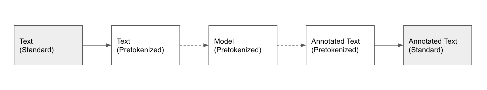

# [Data] Support for Different Data Formats

Annotated data for named entity recognition in its purest form contains raw text together with a list of entities.
Each entity is defined by its position in the raw text and the corresponding tag.

A specific **standard format** which is commonly used in connection with annotation tools looks as follows:

??? example "Example: standard format (*.jsonl)"
    ``` markdown
    {
        "text": "President Barack Obama went to Harvard", 
        "tags": [
            {
                "token": "President Barack Obama", 
                "tag": "PER", 
                "char_start": 0, 
                "char_end": 22
            }, 
            {
                "token": "Harvard", 
                "tag": "ORG", 
                "char_start": 31, 
                "char_end": 38
            }
        ]
    }
    ```
    Note that the above represents one sample that needs to constitute one line in the ``jsonl`` file. The indentations are used for convenience only.

After the data is read in, the model's tokenizer is used to pretokenize it. 
At inference time, the model makes predictions on the pretokenized data. 
Subsequently, these predictions are mapped back to the original text.



Often times, especially in the case of public datasets, the data already comes as pretokenized though.
The **pretokenized format** looks as follows:

??? example "Example: pretokenized format (*.csv)"
    ``` markdown
    PER PER PER O O ORG <tab> President Barack Obama went to Harvard
    ```

In the case of pretokenized data at inference time, the information to map the predictions back to the original text is missing. 
Hence, the last step in the above chart is skipped.

**nerblackbox** can process both the standard and pretokenized format.
See [Custom Datasets](../../../usage/datasets_and_models/#custom-datasets) for details on how to use
a dataset in practice.
