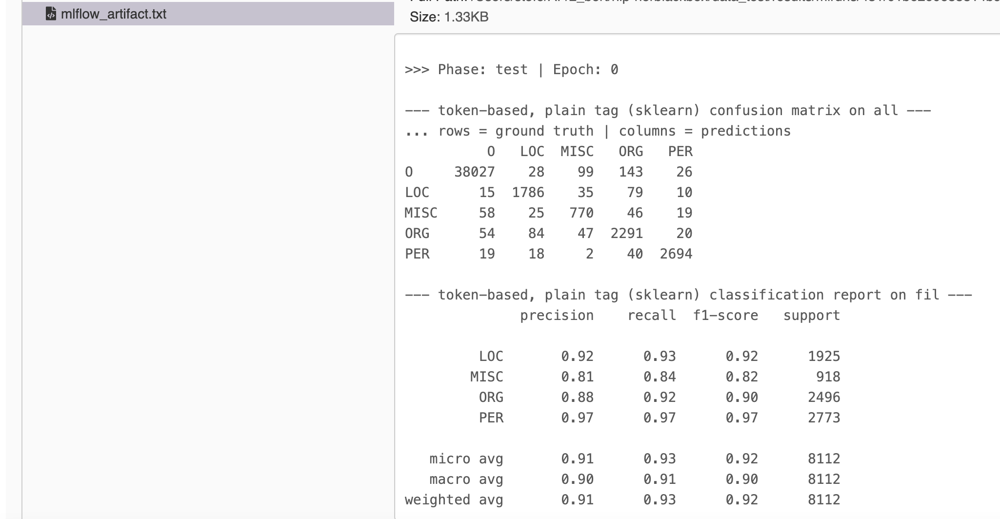

# Detailed Analysis of Training Results

The main results of an experiment, especially the micro-averaged f1 score, can be accessed as follows:

??? note "get main results"
    === "Python"
        ``` python
        experiment_results = nerbb.get_experiment_results("<experiment_name>")
        ```
    === "CLI"
        ``` bash
        nerbb get_experiment_results <experiment_name>  # prints overview on runs
        ```

    Python: see [ExperimentResults](../../python_api/experiment_results) for details on how to use ``experiment_results``

In addition, on may have a look at much more detailed results of an experiment
using `mlflow` or `tensorboard`.

??? note "get detailed results (only CLI)"
    === "CLI"
        ``` bash
        nerbb mlflow       # + enter http://localhost:5000 in your browser
        nerbb tensorboard  # + enter http://localhost:6006 in your browser
        ```

- `mlflow` displays precision, recall and f1 score for every single class, 
    as well the respective micro- and macro-averages over all classes, both on the token and entity level.

    The following excerpt shows

    - the micro- and macro-averages of the recall on the entity level

    - precision, recall and f1 score for the LOC(ation) class on the token level
    
    

    In addition, one has access to the log file and the confusion matrices (token and entity level) 
    of the model predictions on the test set.

    A small excerpt is shown below:

    

- `tensorboard` shows the learning curves of important metrics like the loss and the f1 score.
  
    A small excerpt is shown below:

    
