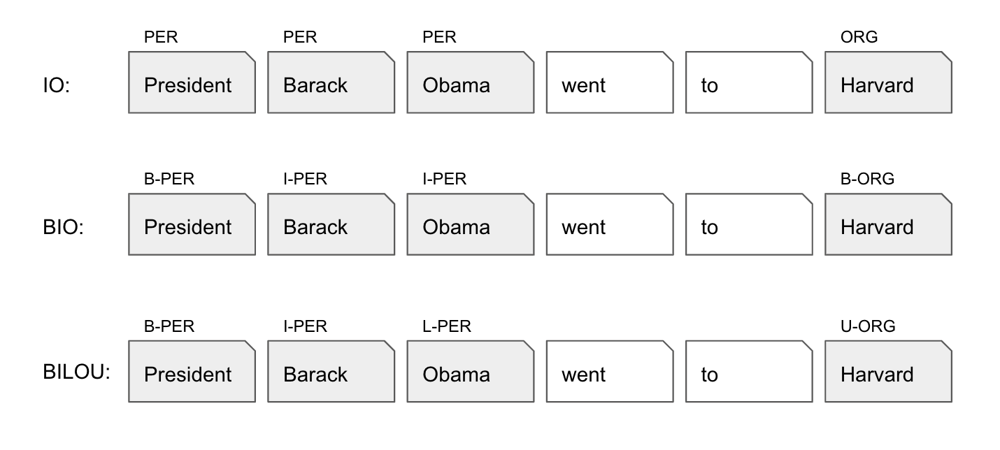

# Support for Various Annotation Schemes

NER datasets come with different annotation schemes, e.g. IO, BIO and BILOU.



**nerblackbox** automatically recognizes and uses the given scheme of a dataset 
if the (default) setting ``auto`` for the [parameter](../../usage/parameters) ``annotation_scheme`` is used:

??? example "annotation scheme auto"
    ``` markdown
    [dataset]
    dataset_name = conll2003
    annotation_scheme = auto
    ```

    The ``conll2003`` dataset will be used in its original BIO scheme.
    

It is also possible to let **nerblackbox** convert a dataset to another annotation scheme.

??? example "annotation scheme conversion"
    ``` markdown
    [dataset]
    dataset_name = conll2003
    annotation_scheme = bilou
    ```

    The ``conll2003`` dataset will be converted from its original BIO scheme to the BILOU scheme.


Note however, that conversion is only possible between the BIO and BILOU schemes, 
as the IO scheme does not possess the same expressiveness.
