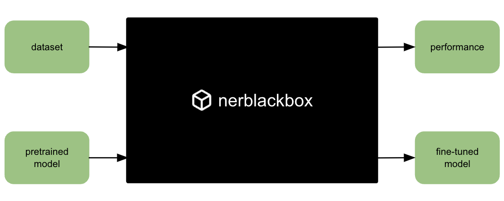

# Overview

**nerblackbox** - a python package to fine-tune transformer-based language models for named entity recognition (NER).

latest version: 0.0.11

-----------
## Resources

* source code: [https://github.com/af-ai-center/nerblackbox](https://github.com/af-ai-center/nerblackbox)
* documentation: [https://af-ai-center.github.io/nerblackbox]([https://af-ai-center.github.io/nerblackbox])
* PyPI: [https://pypi.org/project/nerblackbox](https://pypi.org/project/nerblackbox)

-----------
## About

[Transformer-based language models](https://arxiv.org/abs/1706.03762) like [BERT](https://arxiv.org/abs/1810.04805) have had a [game-changing impact](https://paperswithcode.com/task/language-modelling) on natural language processing.

In order to utilize [HuggingFace's publicly accessible pretrained models](https://huggingface.co/transformers/pretrained_models.html) for
[named entity recognition](https://en.wikipedia.org/wiki/Named-entity_recognition),
one needs to retrain (or "fine-tune") them using labeled text.

**nerblackbox makes this easy.**

{: align=left }

`You give it`

- a **Dataset** (labeled text)
- a **Pretrained Model** (transformers)

`and you get`

- the best **Fine-tuned Model**
- its **Performance** on the dataset

-----------
## Installation

``` bash
pip install nerblackbox
```

-----------
## Usage

- initialize
    ``` python
    nerbb = NerBlackBox()
    ```

- fine-tune a model on a dataset
    ``` python
    nerbb.run_experiment("my_experiment", model="bert-base-cased", dataset="conll2003")
    # [output provides details on the model training]
    ```

- inspect the model
    ``` python
    nerbb.get_experiment_results("my_experiment")
    # [output provides details on the model performance]
    ```

- model inference
    ``` python
    nerbb.predict("my_experiment", "The United Nations has never recognised Jakarta's move.")  
    # [[
    #  {'char_start': '4', 'char_end': '18', 'token': 'United Nations', 'tag': 'ORG'},
    #  {'char_start': '40', 'char_end': '47', 'token': 'Jakarta', 'tag': 'LOC'}
    # ]]
    ```

See [Usage](usage/getting_started) for more details.

-----------
## Features

* adaptive fine-tuning
* hyperparameter search
* detailed analysis of training results
* multiple runs with different random seeds
* support for pretokenized and unpretokenized datasets
* support for various annotation schemes (e.g. BIO, BILOU) and seamless conversion between them
* seamless use of datasets from [HuggingFace Datasets](https://huggingface.co/docs/datasets/)
* special token support
* GPU support
* language agnosticism
* based on [HuggingFace Transformers](https://huggingface.co/transformers/), [PyTorch Lightning](https://www.pytorchlightning.ai/) and [MLflow](https://mlflow.org/docs/latest/index.html)

See [Features](features/overview) for more details.


-----------
## Citation

``` tex
@misc{nerblackbox,
  author = {Stollenwerk, Felix},
  title  = {nerblackbox: a python package to fine-tune transformer-based language models for named entity recognition},
  year   = {2021},
  url    = {https://github.com/af-ai-center/nerblackbox},
}
```

-----------