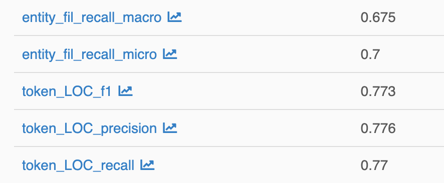
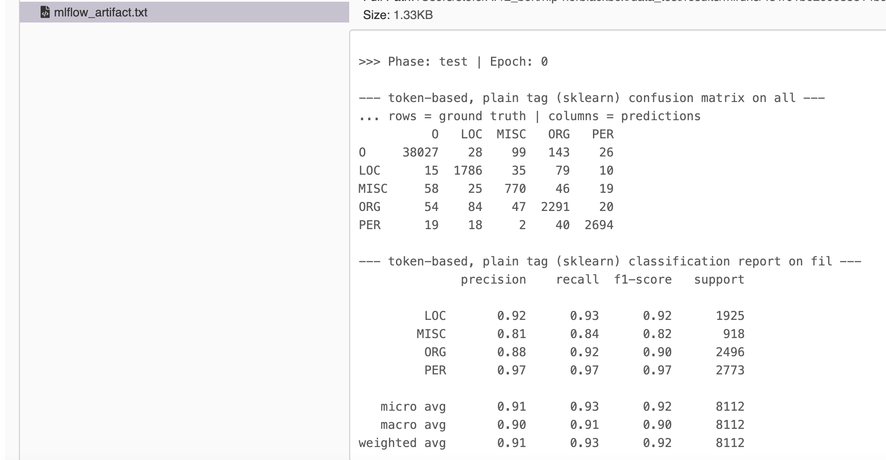
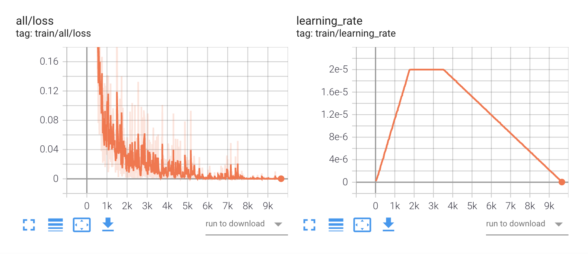

# Training

Given a dataset that is properly [set up](../data), we can fine-tune a pretrained model for Named Entity Recognition.

-----------
## Model Sources

**nerblackbox** works with PyTorch transformer models only. 
They can either be taken straight from HuggingFace (HF) or the Local Filesystem (LF).
In order to employ models from HF, it is sufficient to specify the name of the model (see [Basic Training](#basic-training)).

Local models need to be stored in a directory `./store/pretrained_models/<my_model>` and include the following files:

- `config.json`
- `pytorch_model.bin`
- `vocab.txt`

Note that the name for `<my_model>` must include the architecture type, e.g. `bert`.

-----------
## Basic Training

Fine-tuning a **specific model** on a **specific dataset** using **specific parameters** is called an **experiment**. 
An experiment is handled by the [Experiment](../../python_api/experiment) class.

-----------
### Define an Experiment

An experiment is defined 

- either **dynamically** through arguments when an [Experiment](../../python_api/experiment/) instance is created

    ??? note "define experiment dynamically (only Python API)"
        === "Python"
            ``` python
            experiment = Experiment("<experiment_name>", model="<model_name>", dataset="<dataset_name>")
            ```

- or **statically** by an **experiment configuration** file ``./store/experiment_configs/<experiment_name>.ini``.

    ??? note "define experiment statically"
        === "Python"
            ``` python
            experiment = Experiment("<experiment_name>", from_config=True)
            ```
        === "CLI"
            see 3b.

Note that the dynamic variant also creates an experiment configuration, which is subsequently used.
In both cases, the specification of the `model` and the `dataset` are mandatory and sufficient.
Training [Parameters](#parameters) may be specified but are optional. The hyperparameters that are used by default are globally applicable settings that should give close-to-optimal results for any use case.
In particular, [adaptive fine-tuning](#presets) is employed to ensure that this holds irrespective of the size of the dataset.  

-----------
### Run an Experiment

A fine-tuning experiment is run using the following command:

??? note "run experiment"
    === "Python"
        ``` python
        experiment.run()
        ```
    === "CLI"
        ``` bash
        nerbb run_experiment <experiment_name>  # CLI: only static experiment definition
        ```

See [`Experiment.run()`](../../python_api/experiment/#nerblackbox.api.experiment.Experiment.run) for further details.

-----------
### Main Results

When an experiment is finished, one can get its main results like so:

??? note "Main Results (single experiment)"
    === "Python"
        ``` python
        experiment.get_result(metric="f1", level="entity", phase="test")
        ```

See [`Experiment.get_result()`](../../python_api/experiment/#nerblackbox.api.experiment.Experiment.get_result) for further details.

An overview of all conducted experiments and their main results can be accessed using the [`Store`](../python_api/store) class:

??? note "Main Results (all experiments)"
    === "Python"
        ``` python
        Store.show_experiments()
        ```
    === "CLI"
        ``` bash
        nerbb show_experiments
        ```

-----------
### Example

An English BERT model can be fine-tuned on the CoNLL-2003 dataset like this:

??? example "Example: Training"
    ``` python
    experiment = Experiment("my_experiment", model="bert-base-cased", dataset="conll2003") 
    experiment.run()                                                                       
    experiment.get_result(metric="f1", level="entity", phase="test")                       
    # 0.9045
    ```

-----------
## Advanced Training

### Parameters

**nerblackbox** uses a large amount of default (hyper)parameters that can be customized as needed. 
The concerned parameters just need to be specified when [an experiment is defined](#a-define-an-experiment), 
either statically or dynamically.

- In the **static** case, an experiment configuration file may look like this:

    ??? example "Example: static experiment configuration file with parameters"
        ``` markdown
        [dataset]
        dataset_name = swedish_ner_corpus
        annotation_scheme = plain
        prune_ratio_train = 0.1  # for testing
        prune_ratio_val = 1.0
        prune_ratio_test = 1.0
        train_on_val = False
        train_on_test = False

        [model]
        pretrained_model_name = af-ai-center/bert-base-swedish-uncased

        [settings]
        checkpoints = True
        logging_level = info
        multiple_runs = 1
        seed = 42

        [hparams]
        max_epochs = 250
        early_stopping = True
        monitor = val_loss
        min_delta = 0.0
        patience = 0
        mode = min
        lr_warmup_epochs = 2
        lr_num_cycles = 4
        lr_cooldown_restarts = True
        lr_cooldown_epochs = 7

        [runA]
        batch_size = 16
        max_seq_length = 128
        lr_max = 2e-5
        lr_schedule = constant

        [runB]
        batch_size = 32
        max_seq_length = 64
        lr_max = 3e-5
        lr_schedule = cosine
        ```

- In the **dynamic** case, the equivalent example is:

    ??? example "Example: dynamic experiment with parameters"
        ``` markdown
        ...
        ```

The parameters can be divided into 4 **parameter groups**:

1. Dataset
2. Model
3. Settings
4. Hyperparameters

In the following, we will go through the different parameters step by step to see what they mean.

**1. Dataset**

| Key               | Mandatory | Default Value | Type  | Values                  | Comment                                                                                                                                                                          |          
|---                |---        |---            |---    |-------------------------|----------------------------------------------------------------------------------------------------------------------------------------------------------------------------------|
| dataset_name      | Yes       | ---           | str   | e.g. conll2003          | [Built-in Dataset](../datasets_and_models/#built-in-datasets) or [Custom Dataset](../datasets_and_models/#custom-datasets)                                                       |
| annotation_scheme | No        | auto          | str   | auto, plain, bio, bilou | specify annotation scheme (e.g. [BIO](https://en.wikipedia.org/wiki/Inside%E2%80%93outside%E2%80%93beginning_(tagging))). auto means it is inferred from data |
| prune_ratio_train | No        | 1.0           | float | 0.0 - 1.0               | fraction of train dataset to be used                                                                                                                                             |
| prune_ratio_val   | No        | 1.0           | float | 0.0 - 1.0               | fraction of val   dataset to be used                                                                                                                                             | 
| prune_ratio_test  | No        | 1.0           | float | 0.0 - 1.0               | fraction of test  dataset to be used                                                                                                                                             |
| train_on_val      | No        | False         | bool  | True, False             | whether to train additionally on validation dataset                                                                                                                              |
| train_on_test     | No        | False         | bool  | True, False             | whether to train additionally on test dataset                                                                                                                                    |

??? example "Example: static experiment configuration file with parameters (Dataset)"
    ``` markdown
    [dataset]
    dataset_name = swedish_ner_corpus
    annotation_scheme = plain
    prune_ratio_train = 0.1  # for testing
    prune_ratio_val = 1.0
    prune_ratio_test = 1.0
    train_on_val = False
    train_on_test = False
    ```

**2. Model**

| Key                   | Mandatory | Default Value | Type  | Values                                      | Comment                                                                                                            |          
|---                    |---        |---            |---    |---                                          |---                                                                                                                 |
| pretrained_model_name | Yes       | ---           | str   | e.g. af-ai-center/bert-base-swedish-uncased | [Built-in Model](../datasets_and_models/#built-in-models) or [Custom Model](../datasets_and_models/#custom-models) |

??? example "Example: static experiment configuration file with parameters (Model)"
    ``` markdown
    [model]
    pretrained_model_name = af-ai-center/bert-base-swedish-uncased
    ```

**3. Settings**

| Key               | Mandatory | Default Value | Type  | Values         | Comment                                                                                              |          
|---                |---        |---            |---    |---             |------------------------------------------------------------------------------------------------------|
| checkpoints       | No        | True          | bool  | True, False    | whether to save model checkpoints                                                                    |
| logging_level     | No        | info          | str   | info, debug    | choose [logging level](https://docs.python.org/3/library/logging.html#levels), debug is more verbose |
| multiple_runs     | No        | 1             | int   | 1+             | choose how often each hyperparameter run is executed (to control for statistical uncertainties)      |
| seed              | No        | 42            | int   | 1+             | for reproducibility. multiple runs get assigned different seeds.                                     |

??? example "Example: static experiment configuration file with parameters (Settings)"
    ``` markdown
    [settings]
    checkpoints = True
    logging_level = info
    multiple_runs = 1
    seed = 42
    ```

**4. Hyperparameters**

| Key                  | Mandatory | Default Value | Type  | Values                   | Comment                                                                                                                |          
|---                   |---        |---------------|---    |---                       |---                                                                                                                     |
| batch_size           | No        | 16            | int   | e.g. 16, 32, 64          | number of training samples in one batch             |
| max_seq_length       | No        | 128           | int   | e.g. 64, 128, 256        | maximum sequence length used for model's input data |
| max_epochs           | No        | 250           | int   | 1+                       | (maximum) amount of training epochs                                                                                    |
| early_stopping       | No        | True          | bool  | True, False              | whether to use early stopping                                                                                          |
| monitor              | No        | val_loss      | str   | val_loss, val_acc        | if early stopping is True: metric to monitor (acc = accuracy)                                                                     |
| min_delta            | No        | 0.0           | float | 0.0+                     | if early stopping is True: minimum amount of improvement (w.r.t. monitored metric) required to continue training                  |
| patience             | No        | 0             | int   | 0+                       | if early stopping is True: number of epochs to wait for improvement w.r.t. monitored metric until training is stopped             |
| mode                 | No        | min           | str   | min, max                 | if early stopping is True: whether the optimum for the monitored metric is the minimum (val_loss) or maximum (val_acc) value      |
| lr_warmup_epochs     | No        | 2             | int   | 0+                       | number of epochs to linearly increase the learning rate during the warm-up phase, gets translated to [num_warmup_steps](https://huggingface.co/transformers/main_classes/optimizer_schedules.html#transformers.get_scheduler) |
| lr_max               | No        | 2e-5          | float | e.g. 2e-5, 3e-5          | maximum learning rate (after warm-up) for [AdamW optimizer](https://huggingface.co/transformers/main_classes/optimizer_schedules.html#transformers.AdamW)       |
| lr_schedule          | No        | constant      | str   | constant, linear, cosine, cosine_with_hard_restarts, hybrid | [Learning Rate Schedule](https://huggingface.co/transformers/main_classes/optimizer_schedules.html#schedules), i.e. how to vary the learning rate (after warm-up). hybrid = constant + linear cool-down. |
| lr_num_cycles        | No        | 4             | int   | 1+                       | num_cycles for [lr_schedule = cosine](https://huggingface.co/transformers/main_classes/optimizer_schedules.html#transformers.get_cosine_schedule_with_warmup) or [lr_schedule = cosine_with_hard_restarts](https://huggingface.co/transformers/main_classes/optimizer_schedules.html#transformers.get_cosine_with_hard_restarts_schedule_with_warmup) |
| lr_cooldown_restarts | No        | True          | bool  | True, False              | if early stopping is True: whether to restart normal training if monitored metric improves during cool-down phase                          |
| lr_cooldown_epochs   | No        | 7             | int   | 0+                       | if early stopping is True or lr_schedule == hybrid: number of epochs to linearly decrease the learning rate during the cool-down phase                          |

??? example "Example: static experiment configuration file with parameters (Hyperparameters)"
    ``` markdown
    [hparams]
    max_epochs = 250
    early_stopping = True
    monitor = val_loss
    min_delta = 0.0
    patience = 0
    mode = min
    lr_warmup_epochs = 2
    lr_num_cycles = 4
    lr_cooldown_restarts = True
    lr_cooldown_epochs = 7

    [runA]
    batch_size = 16
    max_seq_length = 128
    lr_max = 2e-5
    lr_schedule = constant

    [runB]
    batch_size = 32
    max_seq_length = 64
    lr_max = 3e-5
    lr_schedule = cosine
    ```

    This creates **2 hyperparameter runs** (`runA` & `runB`). Each hyperparameter run is executed **multiple_runs** times (see [3. Settings](#3-settings)).

-----------
### Presets

In addition to the manual specification of the parameters discussed above, 
the dynamic experiment definition allows for the use of several hyperparameter [presets](./#presets).
They can be specified using the ``from_preset`` argument in [Experiment()](../../python_api/experiment) like so:

??? note "define experiment dynamically using preset"
    === "Python"
        ``` python
        experiment = Experiment("<experiment_name>", model="<model_name>", dataset="<dataset_name>", from_preset="adaptive")
        ```

In the following, we list the different presets together with the [Hyperparameters](./#4-hyperparameters) that they entail:

- ``from_preset = adaptive``

    Adaptive fine-tuning (introduced in [this paper](https://arxiv.org/abs/2202.02617)) is a method that automatically trains for a near-optimal number of epochs.
    It is used by default in **nerblackbox**.

    ??? note "adaptive fine-tuning preset"
        ``` markdown
        [hparams]
        max_epochs = 250
        early_stopping = True
        monitor = val_loss
        min_delta = 0.0
        patience = 0
        mode = min
        lr_warmup_epochs = 2
        lr_schedule = constant
        lr_cooldown_epochs = 7
        ```

- ``from_preset = original``

    Original fine-tuning uses the hyperparameters from the [original BERT paper](https://arxiv.org/abs/1810.04805).
    The hyperparameters are suitable for large datasets.

    ??? note "original fine-tuning preset"
        ``` markdown
        [hparams]
        max_epochs = 5
        early_stopping = False
        lr_warmup_epochs = 2
        lr_schedule = linear
        ```

- ``from_preset = stable``

    Stable fine-tuning is a method based on [this paper](https://arxiv.org/abs/2006.04884).
    It is suitable for both small and large datasets.

    ??? note "stable fine-tuning preset"
        ``` markdown
        [hparams]
        max_epochs = 20
        early_stopping = False
        lr_warmup_epochs = 2
        lr_schedule = linear
        ```

-----------
### Hyperparameter Search

A hyperparameter grid search can easily be conducted as part of an experiment.
The hyperparameters one wants to vary are to be specified in special sections ``[runA]``, ``[runB]`` etc. in the experiment configuration file.

??? example "Example: custom_experiment.ini (Hyperparameter Search)"
    ``` markdown
    [runA]
    batch_size = 16
    max_seq_length = 128
    lr_max = 2e-5
    lr_schedule = constant

    [runB]
    batch_size = 32
    max_seq_length = 64
    lr_max = 3e-5
    lr_schedule = cosine
    ```

    This creates **2 hyperparameter runs** (`runA` & `runB`).

-----------
### Multiple Seeds

The results of a fine-tuning run depend on the employed random seed, see e.g. [this paper](https://arxiv.org/abs/2202.02617) for a discussion.
One may conduct multiple runs with different seeds that are otherwise identical, in order to

- get control over the uncertainties (see [Detailed Analysis of Training Results](../detailed_results/))

- get an improved model performance

Multiple runs can easily be specified in the experiment configuration.

??? example "Example: custom_experiment.ini (Settings / Multiple Runs)"
    ``` markdown
    [settings]
    multiple_runs = 3
    seed = 42
    ```

    This creates 3 runs with seeds 43, 44 and 45.

-----------
### Detailed Results

In addition to the [Main Results](#main-results), one may have a look at much more detailed results of an experiment
using `mlflow` or `tensorboard`.

??? note "Detailed Results"
    === "Python"
        ``` python
        Store.mlflow("start")       # + enter http://localhost:5000 in your browser
        Store.tensorboard("start")  # + enter http://localhost:6006 in your browser
        ```
    === "CLI"
        ``` bash
        nerbb mlflow         # + enter http://localhost:5000 in your browser
        nerbb tensorboard    # + enter http://localhost:6006 in your browser
        ```

    Python: The underlying processes can be stopped using
    [`Store.mlflow("stop")`](../../../python_api/store/#nerblackbox.api.store.Store.mlflow)
    and [`Store.tensorboard("stop")`](../../../python_api/store/#nerblackbox.api.store.Store.tensorboard).

- `mlflow` displays precision, recall and f1 score for every single class,
as well the respective micro- and macro-averages over all classes, both on the token and entity level.

    The following excerpt shows

    - the micro- and macro-averages of the recall on the entity level

    - precision, recall and f1 score for the LOC(ation) class on the token level

    

    In addition, one has access to the log file and the confusion matrices (token and entity level) of the model predictions on the test set.
    A small excerpt is shown below:

    

- `tensorboard` shows the learning curves of important metrics like the loss and the f1 score.

    A small excerpt is shown below:

    
